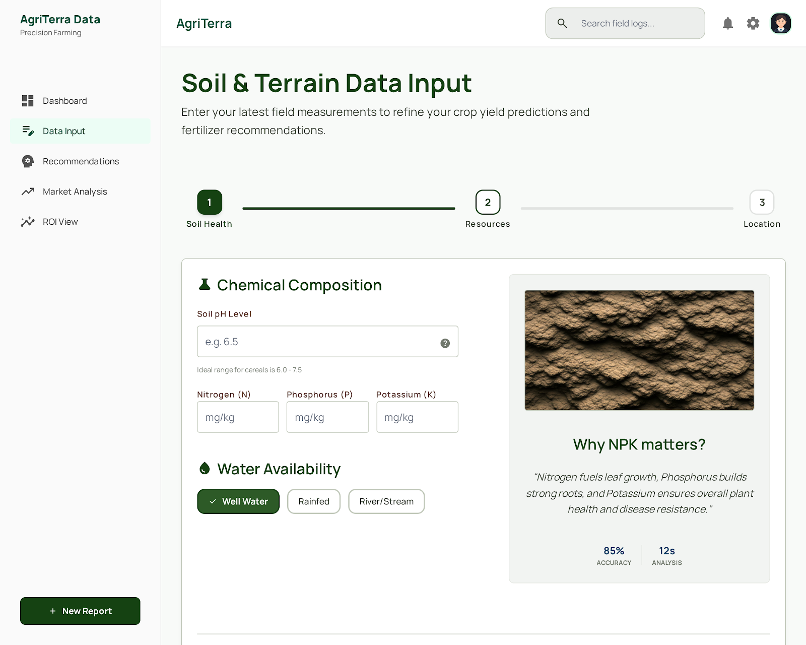

<p align="center">
  
</p>

<h1 align="center">🌾 Aapli Kheti — Crop Intelligence Platform</h1>

<p align="center">
  <strong>AI-powered precision farming assistant for Indian agriculture</strong><br/>
  <em>Smart soil analysis • Disease diagnosis • Market insights • Season planning</em>
</p>

<p align="center">
  
  
  
  
  
</p>

---

## 📸 Screenshot

<p align="center">
  
</p>

---

## 🌟 About

**Aapli Kheti** (आपली खेती — *"Our Farming"* in Marathi) is an AI-driven agricultural intelligence platform designed to empower Indian farmers with data-driven decisions. It combines real-time weather data, AI-powered crop recommendations, disease diagnosis via image scanning, market analysis, and financial planning — all through an intuitive, icon-rich interface accessible to users of all literacy levels.

### Key Highlights

- 🧠 **AI-Powered** — Uses Groq's LLaMA 3.3 70B for intelligent crop & soil analysis
- 🔬 **Vision AI** — LLaMA 3.2 90B Vision for plant disease scanning from photos
- 🌍 **Hyper-Local** — GPS-based weather & forecast data via OpenWeather API
- 🗣️ **Multilingual** — Full support for **English**, **Hindi** (हिंदी), and **Marathi** (मराठी)
- 📱 **Accessible Design** — Icon-heavy, animation-rich UI built for non-literate users
- 🗺️ **Interactive Maps** — Leaflet.js integration for farm location visualization

---

## 🚀 Features

### 1. 📊 Dashboard
Real-time farming overview with:
- **Live Weather** — Temperature, humidity, wind speed, pressure
- **5-Day Forecast** — Daily min/max temps, conditions, humidity trends
- **Interactive Farm Map** — Leaflet-powered GPS location view
- **AI Daily Advisory** — Personalized farming tips, soil advice, risk alerts

### 2. 🧑‍🌾 Smart Soil Estimator
No lab test? No problem:
- Select **soil color** (Dark Black, Reddish Brown, Light Sandy, Grey Clay)
- Describe **water drainage** behavior
- Share **previous crop** and **fertilizer** history
- AI estimates soil pH & NPK levels, then recommends top 3 crops

### 3. 🗓️ Season Planner
Plan ahead with AI predictions:
- **Next Season Prediction** — Weather outlook + recommended crops for upcoming months
- **12-Month Farming Calendar** — Month-by-month tasks, ideal crops, and tips for Rabi/Kharif/Summer seasons

### 4. 📸 Crop Doctor
AI-powered plant pathology:
- Upload a photo of your crop (drag & drop or click)
- AI identifies the plant species, any disease/pest/deficiency
- Provides severity level, cause, treatment (organic + chemical), and prevention

### 5. 📈 Market Analysis
Stay informed on prices:
- Search any crops (comma-separated)
- Get current prices (INR/quintal), price trends, demand levels
- Best time to sell recommendations and market outlook

### 6. 💰 ROI Calculator
Financial planning for farmers:
- Input crop name, farm area (acres), total investment (₹)
- Get detailed cost breakdown, expected yield, revenue, net profit
- ROI percentage, break-even analysis, risk factors, and optimization tips

---

## 🛠️ Tech Stack

| Layer | Technology |
|-------|-----------|
| **Backend** | Python, FastAPI, Uvicorn |
| **AI Engine** | Groq Cloud — LLaMA 3.3 70B (text) + LLaMA 3.2 90B Vision (images) |
| **Weather** | OpenWeather API (current + 5-day forecast) |
| **Frontend** | Vanilla HTML5, CSS3, JavaScript |
| **Maps** | Leaflet.js with OpenStreetMap tiles |
| **Typography** | Google Fonts — Manrope |
| **Icons** | Google Material Symbols |
| **Design System** | Custom CSS with Material-inspired tokens |

---

## 📦 Project Structure

```
Aapli-Kheti/
├── main.py                 # FastAPI application — all API routes & AI logic
├── requirements.txt        # Python dependencies
├── .env.example            # Environment variable template
├── .gitignore              # Git ignore rules
├── DESIGN.md               # Design system documentation (colors, typography, spacing)
├── screen.png              # Application screenshot
├── templates/
│   └── index.html          # Single-page application HTML
└── static/
    ├── css/
    │   └── style.css       # Complete styling & animations
    └── js/
        └── app.js          # Frontend logic — API calls, navigation, UI interactions
```

---

## ⚡ Quick Start

### Prerequisites

- **Python 3.10+** installed
- **Groq API Key** — Get one free at [console.groq.com](https://console.groq.com)
- **OpenWeather API Key** *(optional)* — Get one at [openweathermap.org](https://openweathermap.org/api)

### 1. Clone the Repository

```bash
git clone https://github.com/Ibrahim1224/Aapli-Kheti.git
cd Aapli-Kheti
```

### 2. Create Virtual Environment

```bash
python -m venv venv
source venv/bin/activate        # macOS/Linux
# venv\Scripts\activate         # Windows
```

### 3. Install Dependencies

```bash
pip install -r requirements.txt
```

### 4. Configure Environment Variables

```bash
cp .env.example .env
```

Edit `.env` and add your API keys:

```env
GROQ_API_KEY=your_actual_groq_api_key
OPENWEATHER_API_KEY=your_actual_openweather_api_key
```

> **Note:** The app works without an OpenWeather key (uses simulated weather data), but the Groq API key is **required** for all AI features.

### 5. Run the Application

```bash
uvicorn main:app --reload --port 8000
```

Open your browser at **[http://127.0.0.1:8000](http://127.0.0.1:8000)** 🚀

---

## 🔌 API Reference

| Method | Endpoint | Description |
|--------|----------|-------------|
| `GET` | `/` | Serve the main application |
| `GET` | `/api/weather?lat=&lon=` | Get current weather data |
| `GET` | `/api/forecast?lat=&lon=` | Get 5-day weather forecast |
| `GET` | `/api/dashboard?lat=&lon=&language=` | Full dashboard with weather + AI advisory |
| `POST` | `/api/recommend` | Crop recommendation (with soil NPK data) |
| `POST` | `/api/smart-recommend` | Smart recommendation (visual questionnaire) |
| `POST` | `/api/scan-disease` | Disease diagnosis from crop image |
| `POST` | `/api/market-analysis` | Market price analysis for crops |
| `POST` | `/api/roi` | ROI calculation for farming investment |
| `POST` | `/api/season-predict` | Next season weather & crop prediction |
| `POST` | `/api/seasonal-calendar` | Generate 12-month farming calendar |

---

## 🌐 Language Support

The platform supports three languages, switchable from the header dropdown:

| Language | Script | Code |
|----------|--------|------|
| 🌐 English | Latin | `English` |
| 🇮🇳 Hindi | Devanagari (हिंदी) | `Hindi` |
| 🇮🇳 Marathi | Devanagari (मराठी) | `Marathi` |

All AI responses are generated natively in the selected language.

---

## 🤝 Contributing

1. Fork the repository
2. Create a feature branch (`git checkout -b feature/amazing-feature`)
3. Commit your changes (`git commit -m 'Add amazing feature'`)
4. Push to the branch (`git push origin feature/amazing-feature`)
5. Open a Pull Request

---

## 👥 Team

| Member | GitHub |
|--------|--------|
| Ibrahim | [@Ibrahim1224](https://github.com/Ibrahim1224) |

---

## 📄 License

This project is open source and available under the [MIT License](LICENSE).

---

<p align="center">
  Made with ❤️ for Indian Farmers<br/>
  <strong>🌾 आपली खेती — Our Farming, Our Future 🌾</strong>
</p>
